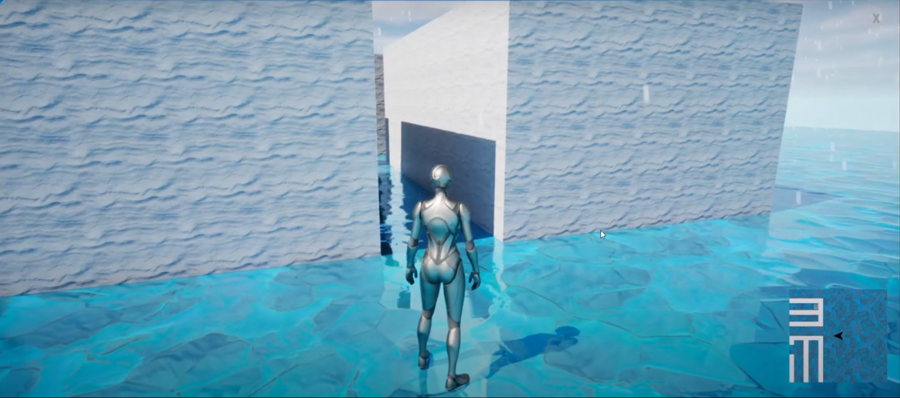
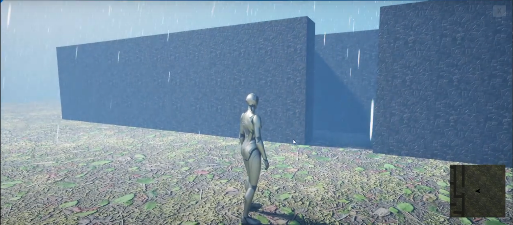
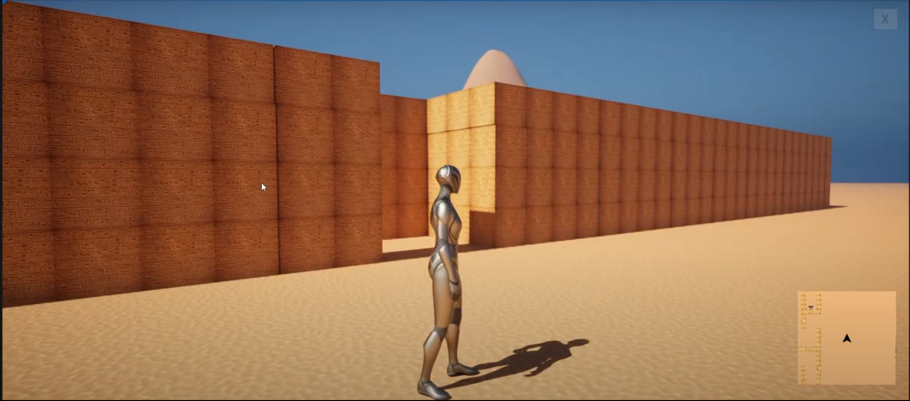
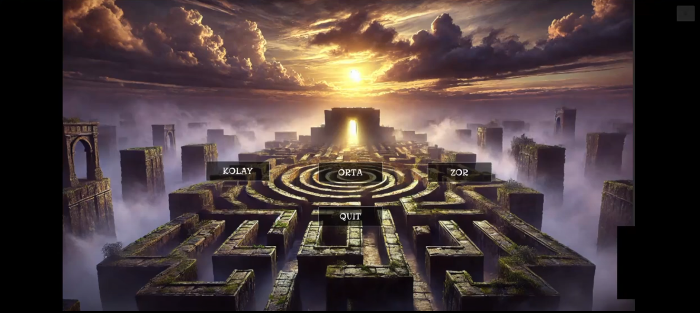
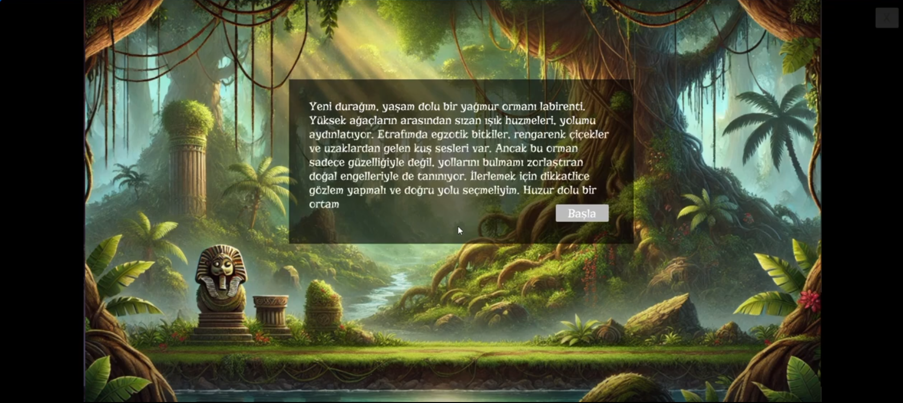
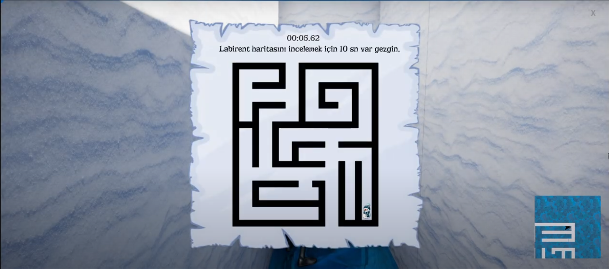
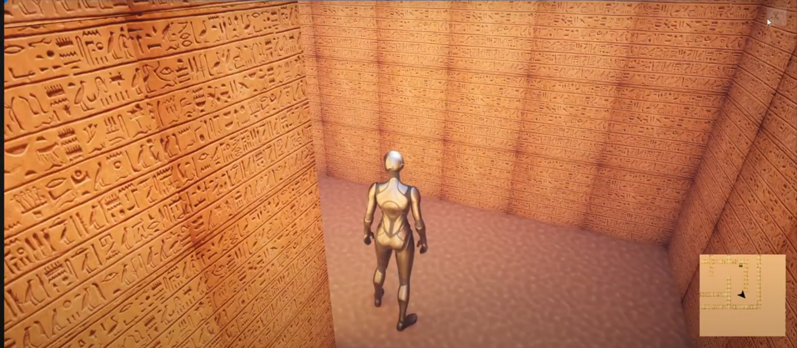
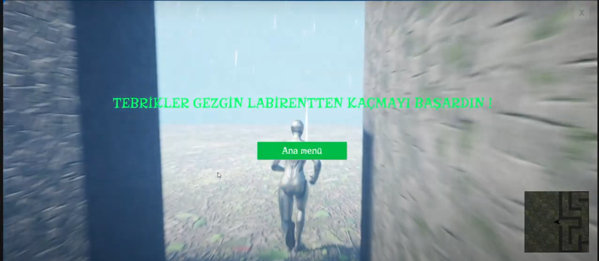

# 3D Maze Escape - Unreal Engine 3D Maze Adventure Game

### Project Overview
**Maze Escape** is a 3D adventure game developed using Unreal Engine 5. The player must navigate through various themed mazes (Ice, Rainforest, Ancient Egypt), follow clues, and solve puzzles to find the exit. With three difficulty levels, interactive hints, and immersive atmospheres, the game offers both fun and educational value.

---

## Features

- **3 Difficulty Levels**: Easy, Medium, Hard
- **Themed Environments**: Snow, Rain, and Sand effects enrich the experience
- **Mini Map**: A dynamic map shows the player's position
- **Chest Mechanics**: Interactive chests that provide map, light, sound, and text-based clues
- **Light & Sound Clues**: Dynamic lights and audio guidance highlight the correct path
- **Storytelling Themes**: Typewriter effect used for immersive narrative intros
- **AI-Generated Menu Design**: Background visuals created using AI
- **Victory Scenario**: Upon reaching the exit, the game pauses and a victory screen is shown

---

## Technologies Used

- **Unreal Engine 5**
- **Blueprint System**
- **Niagara VFX System**
- **Widget Blueprint (UI)**
- **Typewriter Text Animation**
- **Render Target Mini Map**

---

## Gameplay Snapshots

| Ice Maze | Rainforest | Ancient Egypt |
|----------|------------|----------------|
|  |  |  |

---

## 👥 Contributors

- [**Berna Çakır**](https://github.com/berinackr)  
- [**Şeyma Coştur**](https://github.com/Seymacos)  
- [**Selay Yırtımcı**](https://github.com/syrtm)

---

## 🧪 Challenges & Solutions

| Challenge | Solution |
|----------|----------|
| Widget not removed when timer reached 0 | Checked with `<= 0` instead of strict 0 |
| Materials not appearing correctly | Properly mapped Base Color, Roughness, etc. |
| Character kept running after win screen | Used `Set Game Paused` to freeze the game |
| Niagara VFX caused performance issues | Applied GPU optimizations and tuned spawn rate |

---

## Screenshots

  
  
  
  
  

🎥 **Demo Video:** [Watch on YouTube](https://youtu.be/kuPvIW9N2lA?si=dQ4TldWlIAUafaXq)
